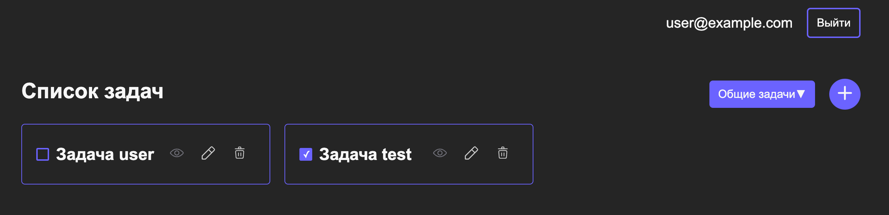

Приложение для управления задачами с поддержкой авторизации и работы с личными и общими задачами.

### Функционал
Авторизация:
Форма входа с полями email и пароль.
Список задач:
Вывод списка задач в виде карточек.
Фильтрация задач на “мои задачи” и “общие задачи”.
Работа с задачами:
Создание, редактирование задачи, удаление задачи.
Индикация загрузки:
Показывать прелоадер или спиннер во время загрузки данных.

### Технологии: 
React, typescript, vite, module.scss, json-server, json-server-auth

#### Запуск проекта

#### Скачайте архив проекта или склонируйте репозиторий

```sh
git@github.com:lkhusnullina/tasks.git
```

#### Установите зависимости проекта

```sh
npm install
```

#### Запустите server командой 

```sh
npm run server
```
#### Запустите проект командой в новом терминале

```sh
npm run dev
```


### User

email: <user@example.com>

password: 11211121

### Test

email: <test@example.com>

password: 11211121
